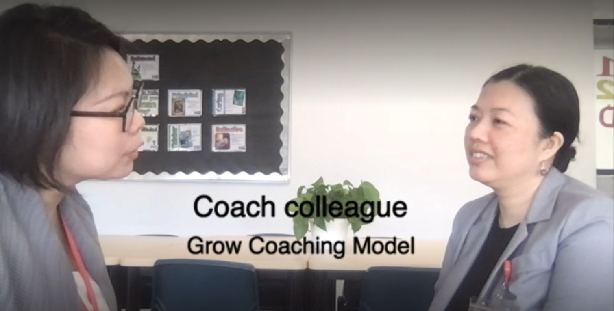

## Case Study

As it showed in the video, in this coaching, I used the four steps of the GROW model.

### Step 1 - Goal

I used some questions to help my coachee define clear goals, so I asked questions such as "Is there any specific problem you want to solve recently?" Following my question, my coachee stated that she wanted to solve the problems of multilevels and poor teaching efficiency in Chinese foreign language classes.

### Step 2 - Reality

My coachee is clear about the status quo without guidance. She has already analyzed the status quo at the stage of clarifying the goal, so we did not stay too long in this stage. 

### Step 3 - Options

In this stage, I asked, "Are  there any  other solutions besides  this  solution?" and some other similar questions to inspire my coachee to open up her mind and find more possibilities plan. I also asked "what is the biggest obstacle to implementing this plan" to try to guide her to evaluate which strategy is most feasible. With the questions, my coachee proposed several possible solutions, such as suggesting that the school use bilingual teachers to help Chinese beginners learn Chinese and English simultaneously; bring in some interns into the classroom to help students with the preview and revision; letting school teachers share empty classrooms so that interns can conduct group-teaching, etc. 

### Step 4 - Will

Although my coachee proposed several feasible solutions, she didn't determine what needed to do immediately or what is the first action. It may be related to my failure to abide by the main points of Grow coaching because, during the coaching process, I couldn't help suggesting my coachee what to do as the Head of Department, which hindered the effect of the coaching and didn’t allow my coachee to solve the problem initiatively. Through this coaching, I realized that even if you are familiar with the issues discussed by the coachee, you should not suggest solutions or communicate specific strategies but inspire the coachee to find solutions to problems through open questions. In this situation, the coach is no need to be familiar with the issue, which could be better to guide/lead the coaching. 

## Next Step

Use the GROW model more often for coaching in my department and use more open questions to help the coachee to recognise and find out the core of the issue and the solutions.

## Useful resources

- [What is GROW?](docs/What%20is%20GROW.pdf)
- [How to use the GROW model](https://www.youtube.com/watch?v=D7U0p-JIqcw)
- [The GROW model in action](https://www.youtube.com/watch?v=6f3X2PEsV-Q)