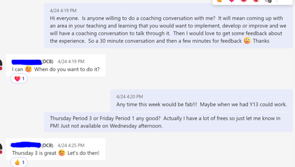
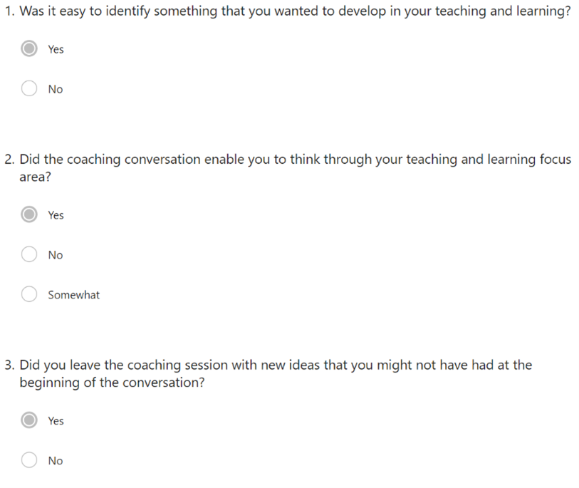
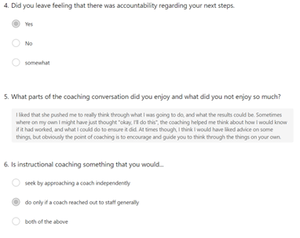
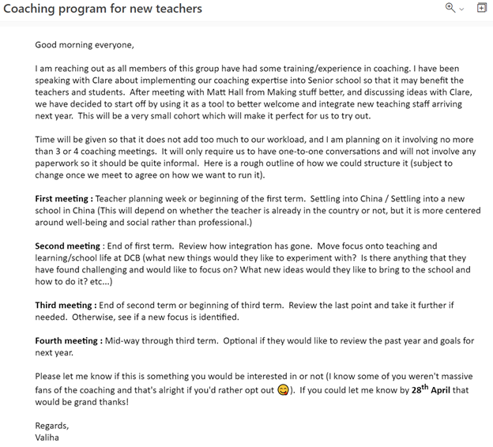

After completing a coaching course last year with Making Stuff Better, I was interested to apply it through different areas of teaching and learning.  Although many pastoral and academic leaders had also completed the same course, many had moved on and the move towards a coaching culture wasn’t really going anywhere, which made it difficult to get a sense of where to take this skill.  It didn’t feel natural going up to people asking them whether they’d want to be coached in an environment where coaching wasn’t a part of everyday life.  In the end, I decided to use it mainly with students, but I was constantly wondering how beneficial teachers might view it.  After meeting the instructional coach from another Beijing school, I decided to reach out and see if anyone wanted to help me out with it.

## Reflection

We managed to meet up and have a conversation regarding feedback and formative assessments.  It was tricky doing it with someone from my own department as I did find it difficult to remain a coach whilst discussing a course that I also taught.  I decided to ask for feedback via a FORMS questionnaire.   Overall, it seemed to be a beneficial conversation to have had, however, as indicated by the last question, the lack of coaching culture within the school could be something that would mean these conversations would not be sought after naturally unless offered explicitly.

Next year, I will be looking to trial a coaching partnership with existing teachers and new members of staff who will be joining the school. Here are the details of the plan so far that I put in an email to a handful of staff who have also got experience in coaching.  Hoepfully if we set this up with new staff then it will catch on and become a part of our teaching and learning development.

